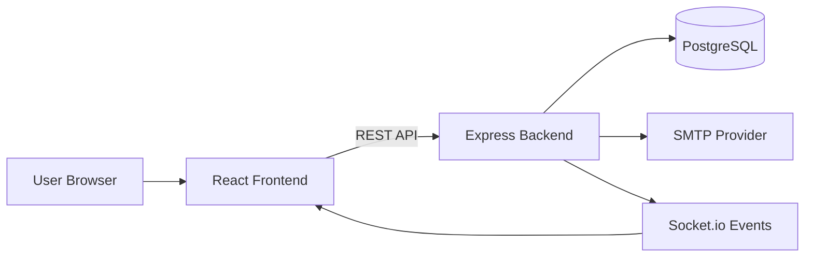
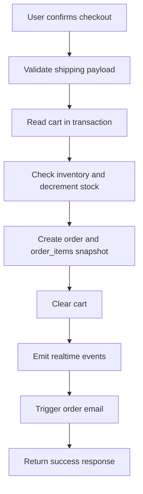
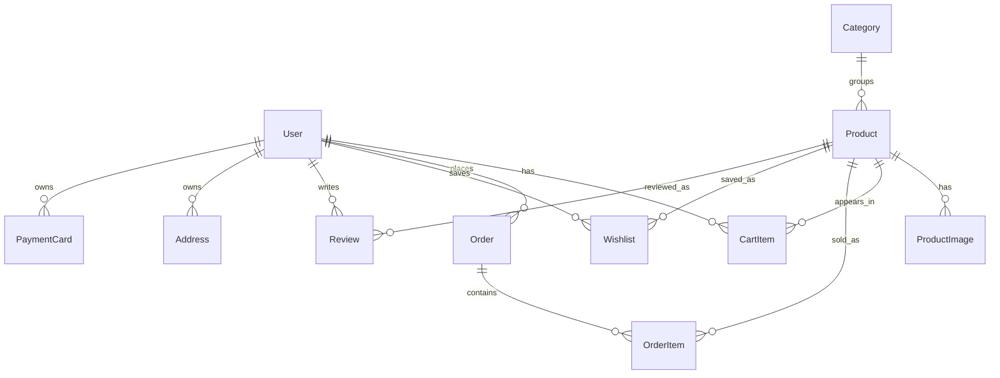

# Amazon Clone Fullstack Project

A production-grade Amazon-inspired ecommerce platform built for the Scalar SDE Internship Fullstack Assignment.

## Live Deployment

- Frontend: https://amazon-clone-teal-xi.vercel.app
- Backend API: https://amazon-clone-scalar-assignment.onrender.com

## 1. Overview

This project delivers a complete ecommerce workflow with production-oriented engineering practices:

- Product browsing, filtering, sorting, and search
- Product detail experience with buy box and recommendations
- Shopping cart and checkout flow
- Order placement with transactional integrity and stock-safe updates
- Order history and wishlist management
- Account management for profile, saved addresses, and payment methods
- Automated order confirmation emails

## 2. Assignment Coverage

### Mandatory Requirements

| Requirement | Implementation | Status |
|---|---|---|
| Amazon-like user interface | Multi-page storefront with Amazon-inspired layout and navigation | Complete |
| Product listing and detail | Category listing, filters, detail pages, ratings, and pricing | Complete |
| Cart and checkout | Quantity updates, cart summary, checkout confirmation | Complete |
| Order history | Historical order listing with statuses and details | Complete |
| Database design | Relational schema using Prisma ORM and PostgreSQL | Complete |
| Seeded catalog | Realistic seeded catalog with categories, products, and images | Complete |

### Bonus Features

| Feature | Status |
|---|---|
| Responsive design | Complete |
| Wishlist support | Complete |
| Email notification on order placement | Complete |
| Account details and saved addresses | Complete |

## 3. Technology Stack

### Frontend

- React 18 with Vite
- React Router v6
- Axios for API integration
- Socket.io client for real-time updates
- CSS with responsive breakpoints

### Backend

- Node.js with Express
- Prisma ORM
- PostgreSQL (Neon)
- Nodemailer (SMTP)
- Socket.io

### Deployment

- Vercel for frontend hosting
- Render for backend hosting
- Neon PostgreSQL for database

## 4. Architecture



## 5. Order Flow



## 6. Database Model Summary



Design choices:

- Order items store unit price snapshots for historical accuracy
- Shipping address is captured on the order record to preserve checkout-time details
- Address and payment entities support reusable account data

## 7. Screenshot Gallery

### Home


### Product Listing


### Product Detail


### Cart


### Checkout


### Account


### Wishlist


### Orders


### Email Confirmation


### Brainstorming Notes


## 8. Local Setup

### Backend

```bash
cd server
npm install
npm run db:seed
npm run dev
```

### Frontend

```bash
cd client
npm install
npm run dev
```

## 9. Environment Variables

### Server

- DATABASE_URL
- DIRECT_URL
- PORT
- CORS_ORIGIN
- NODE_ENV
- SMTP_HOST
- SMTP_PORT
- SMTP_SECURE
- SMTP_USER
- SMTP_PASS
- MAIL_FROM

### Client

- VITE_API_URL

## 10. Deployment Notes

- Backend deployed on Render as a Web Service rooted at server
- Frontend deployed on Vercel rooted at client
- CORS must include both localhost and deployed frontend domains

## 11. Additional Documentation

- Frontend guide: client/README.md
- Backend guide: server/README.md
- Project report: docs/REPORT.md
- Screenshot checklist: docs/screenshots/README.md
