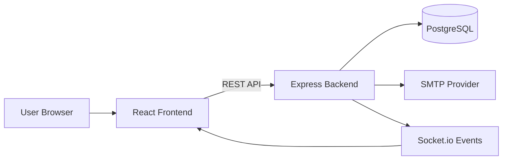
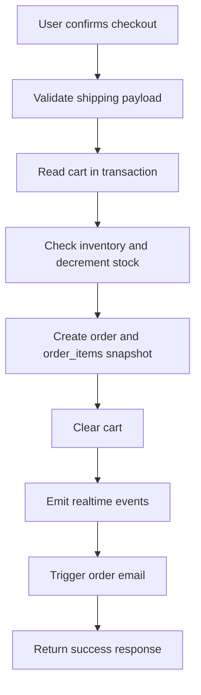
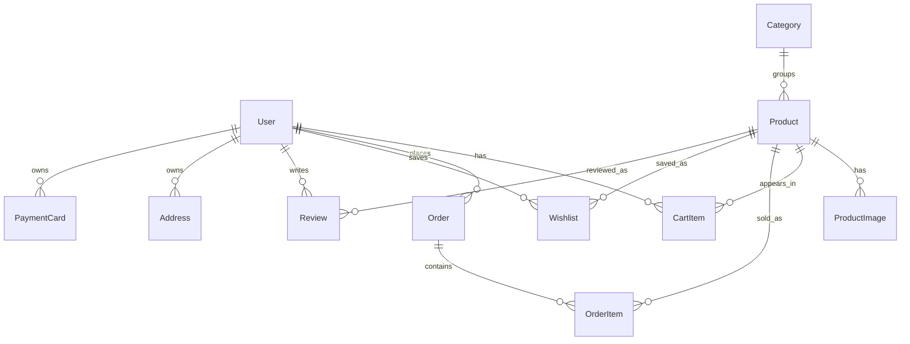

# Amazon Clone Fullstack Project

A production-style Amazon-inspired ecommerce application built for the Scalar SDE Intern Fullstack Assignment.

## 1. Project Summary

This project implements a realistic ecommerce flow with a strong Amazon-like UI and robust backend behavior:

- Product browsing, filtering, and search
- Product detail and buy box flow
- Cart management and checkout
- Order placement with idempotency and stock protection
- Order history and wishlist
- Account management (profile, addresses, payment methods)
- Order confirmation email notifications

## 2. Assignment Coverage

### Mandatory scope

- Amazon-like UI across main storefront journeys: Implemented
- Product listing/detail/cart/checkout/order history: Implemented
- Seeded sample catalog with multiple categories: Implemented
- Custom database schema design: Implemented with Prisma models and relationships

### Good to Have (Bonus)

- Responsive design (mobile/tablet/desktop): Implemented
- User authentication: Intentionally not implemented (assignment says no login required)
- Order history: Implemented
- Wishlist: Implemented
- Email notification on order placement: Implemented

## 3. Tech Stack

- Frontend: React + Vite + React Router + Axios
- Backend: Node.js + Express
- Database: PostgreSQL + Prisma ORM
- Real-time events: Socket.io
- Email: Nodemailer (SMTP)

## 4. Repository Structure

- client: React frontend app
- server: Express API, Prisma schema, seed logic
- docs: project diagrams and screenshot placeholders

## 5. Architecture Diagram



## 6. Order Flow Diagram



## 7. Database Design (ER Summary)



Key schema choices:

- Order items store unit price snapshots for historical integrity.
- Shipping address is persisted as JSON on orders.
- Address and payment models support account realism.

## 8. Development Approach & Key Decisions

### Email Notifications
- Implemented as **async, non-blocking** dispatch after order placement
- Uses Nodemailer with Gmail SMTP for production delivery
- Branded HTML template with order details, items, and shipping address
- Fallback to text format for compatibility

### Address & Shipping Management
- Saved addresses with autofill on checkout
- Users can select or provide new address at purchase time
- Addresses persisted as structured data for account reuse

### Deployment Architecture
- **Backend:** Node.js + Express on Render (scalable, PostgreSQL-ready)
- **Database:** PostgreSQL (Neon serverless) for reliability and ACID compliance
- Removed Redis to simplify deployment footprint while maintaining performance
- **Frontend:** React on Vercel for edge deployment and automatic CI/CD
- CORS configured to support both local development and production URLs

### Data Seeding Strategy
- Comprehensive seed script with 250+ products, 30 categories, 724 product images
- Sample orders pre-populated for order history testing
- User addresses and payment methods included for realistic UX
- Seed runs during `npm run db:seed` (development) or Render build process

### Product & Media Management
- Dynamic product loading from PostgreSQL
- Product images served with optimized URLs from database
- Catalog extensible via seed or admin dashboard (future)

### Frontend Features
- Wishlist with persistent storage
- Order history with status tracking
- Account page with profile, addresses, and payment methods
- Responsive design for mobile, tablet, desktop

## 9. Screenshots

Add project screenshots to docs/screenshots using these names:

- home.png
- product-listing.png
- product-detail.png
- cart.png
- checkout.png
- account.png
- wishlist.png
- orders.png
- email-confirmation.png
- brainstorm-ideas.png (development brainstorming notes)

A quick placeholder guide exists in docs/screenshots/README.md.

## 10. Local Setup

### Backend

```bash
cd server
npm install
npm run db:seed
npm run dev
```

### Frontend

```bash
cd client
npm install
npm run dev
```

## 11. Environment Variables

### server/.env

- DATABASE_URL
- DIRECT_URL
- PORT
- CORS_ORIGIN
- NODE_ENV
- SMTP_HOST
- SMTP_PORT
- SMTP_SECURE
- SMTP_USER
- SMTP_PASS
- MAIL_FROM

### client/.env

- VITE_API_URL

## 12. Render Deployment Guide

You can deploy using the included blueprint file:

- render.yaml

### API service (Render Web Service)

- Root Directory: server
- Build Command: npm install
- Start Command: npm start
- Environment: Node
- Required env vars: DATABASE_URL, DIRECT_URL, NODE_ENV, CORS_ORIGIN
- Optional env vars: SMTP_HOST, SMTP_PORT, SMTP_SECURE, SMTP_USER, SMTP_PASS, MAIL_FROM

### Frontend service (Render Static Site)

- Root Directory: client
- Build Command: npm install && npm run build
- Publish Directory: dist
- Required env var: VITE_API_URL set to your API URL with /api suffix

Example:

- VITE_API_URL=<https://your-api-name.onrender.com/api>

## 13. Submission Notes and Assumptions

- The assignment explicitly states that login is not required, so a default seeded user is used.
- Redis was removed to keep runtime simple and portable for deployment.
- Email sending is production-ready when SMTP credentials are configured.

## 14. Additional Docs

- Frontend docs: client/README.md
- Backend docs: server/README.md
- Formal project report: docs/REPORT.md
- Screenshot guide and checklist: docs/screenshots/README.md
