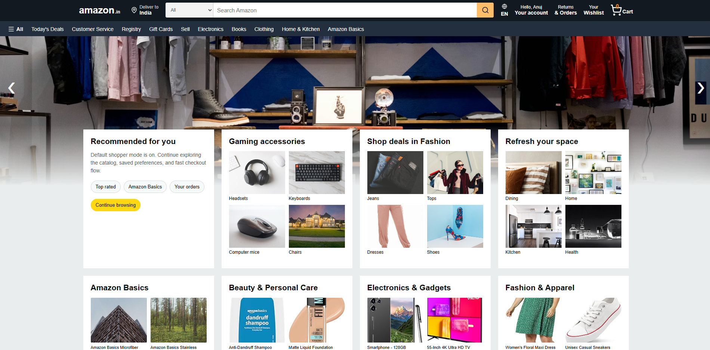
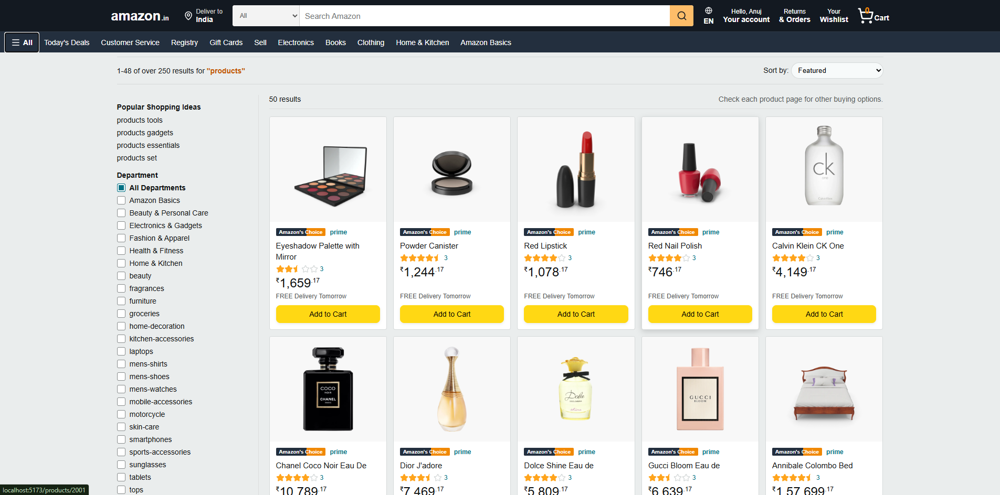
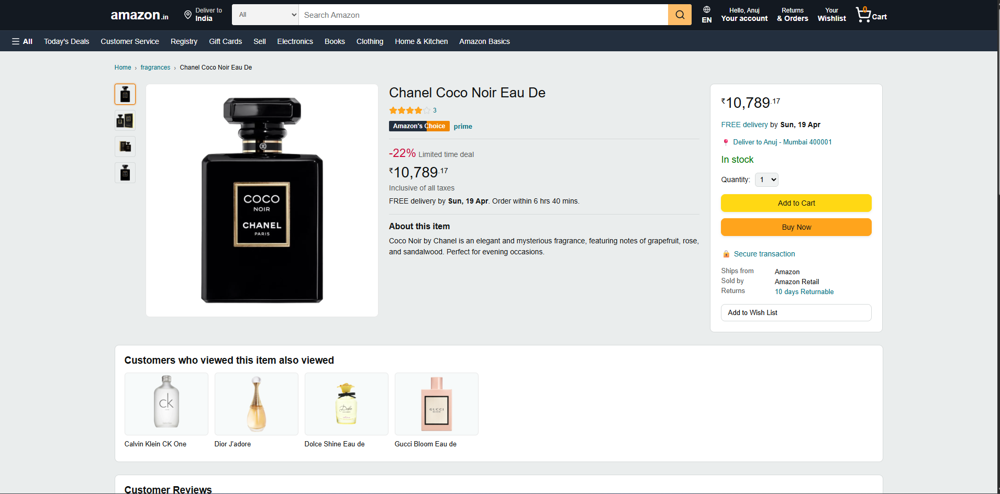
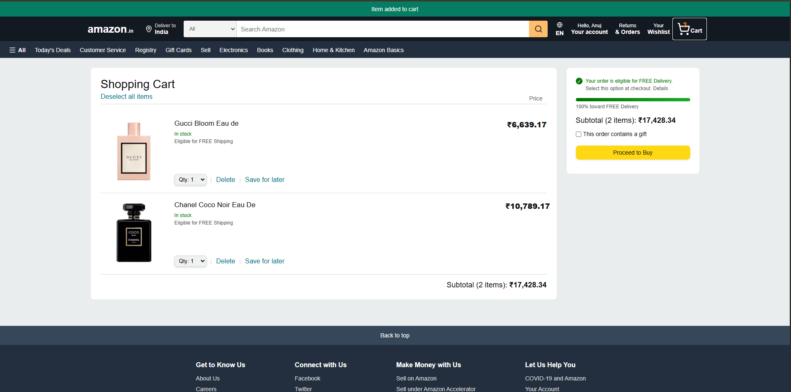
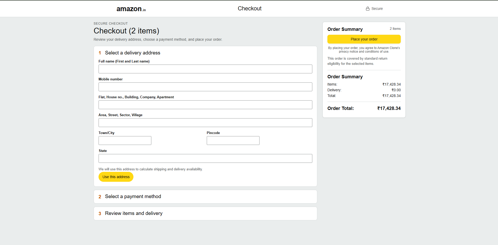
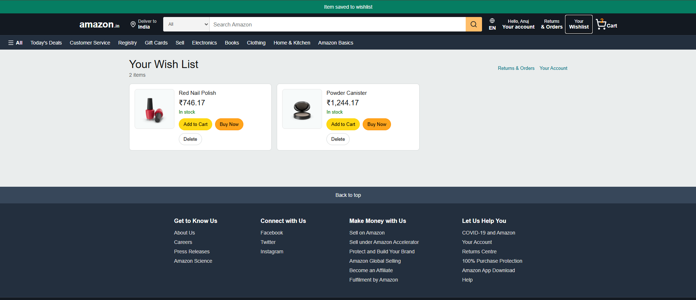
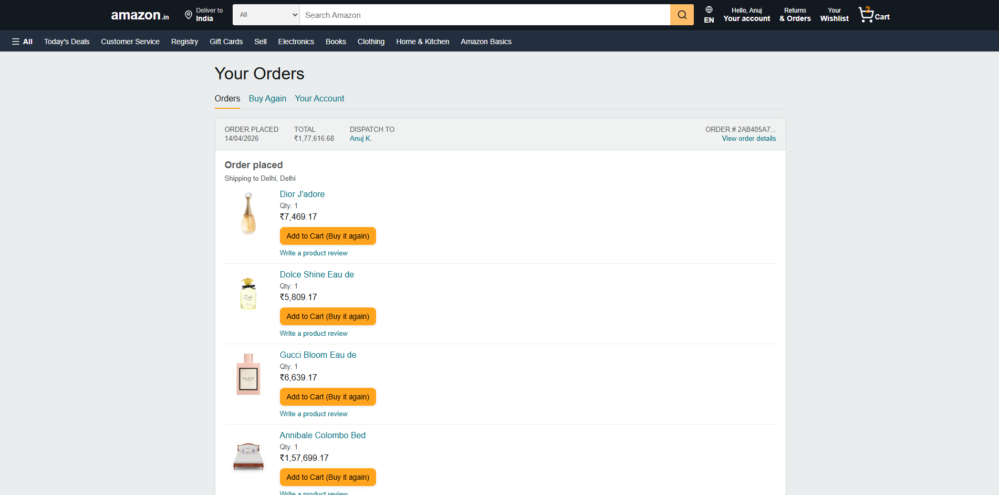

# Client Application

React frontend for the Amazon Clone project.

## Live URL

- Frontend: https://amazon-clone-teal-xi.vercel.app

## Scope

- Amazon-like navigation and page layouts
- Product listing and product detail pages
- Cart, checkout, wishlist, and account pages
- API integration using Axios

## Commands

```bash
npm run dev
npm run build
npm run lint
npm run preview
```

## Environment

Create client/.env:

```bash
VITE_API_URL=http://localhost:5000/api
```

Production value:

```bash
VITE_API_URL=https://amazon-clone-scalar-assignment.onrender.com/api
```

## Deployment

- Platform: Vercel
- Root Directory: client
- Build Command: npm run build
- Output Directory: dist

## Client Screenshots

### Home



### Product Listing



### Product Detail



### Cart



### Checkout



### Wishlist



### Orders


