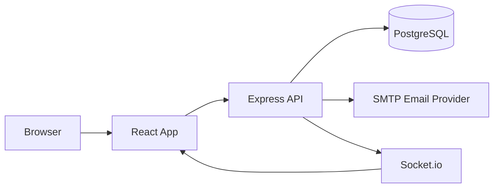
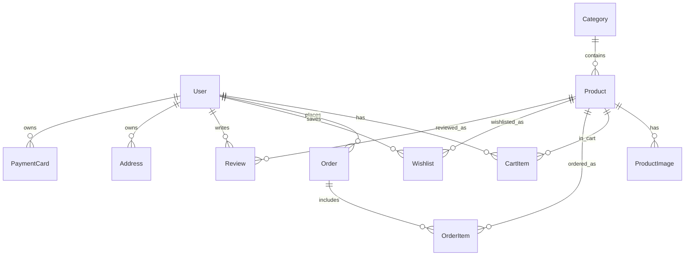
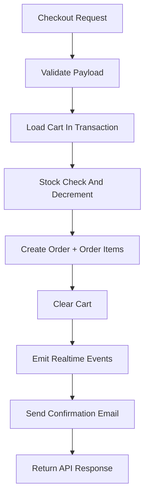

# Amazon Clone Project Report

## 1. Executive Summary

This project delivers a full-stack ecommerce application inspired by Amazon, built as part of the Scalar SDE Intern Fullstack Assignment. The implementation covers core commerce functionality end-to-end: catalog discovery, product detail view, cart operations, checkout, order persistence, wishlist, order history, account management, and email confirmation.

The system is designed with assignment scope in mind:

- default logged-in user model (no auth flow)
- realistic seeded catalog and order data
- normalized relational schema
- production-oriented API behavior (idempotency, rate limiting, stock-safe order flow)

## 2. Objectives And Scope

### Objectives

- Reproduce Amazon-like shopping UX and page structure
- Build robust backend APIs for commerce operations
- Use PostgreSQL with a custom schema designed for extensibility
- Seed realistic data across multiple categories
- Support deployment-ready configuration

### In-Scope Features

- Product listing and filtering
- Product detail page
- Cart and checkout flow
- Orders and order history
- Wishlist
- Account section with addresses and payment cards
- SMTP order-confirmation email

### Out-of-Scope By Assignment

- Full login/signup authentication system

## 3. Technology Stack

- Frontend: React, Vite, React Router, Axios
- Backend: Node.js, Express
- Database: PostgreSQL
- ORM: Prisma
- Realtime events: Socket.io
- Email service: Nodemailer with SMTP

## 4. Architecture Overview

## 5. Data Model Overview

Primary entities:

- User
- Category
- Product
- ProductImage
- CartItem
- Order
- OrderItem
- Wishlist
- Review
- Address
- PaymentCard

Key design decisions:

- `orders.shippingAddress` stored as JSON snapshot at purchase time
- `order_items.unitPrice` stores price snapshot for historical accuracy
- address/card models support realistic account experience

## 6. Order Processing Flow

## 7. Feature Validation Summary

- UI pages aligned to Amazon-style layout and spacing
- Wishlist and order history functional
- Account tab navigation and data forms functional
- SMTP email delivery tested with Gmail app password
- Seed pipeline includes diverse products, Amazon Basics entries, addresses, cards, and sample orders

## 8. Deployment Readiness (Render)

### Backend (Render Web Service)

- Root: `server`
- Build: `npm install && npx prisma generate`
- Start: `npm start`
- Env vars: `DATABASE_URL`, `DIRECT_URL`, `PORT`, `NODE_ENV`, `CORS_ORIGIN`, SMTP vars

### Frontend (Render Static Site)

- Root: `client`
- Build: `npm install && npm run build`
- Publish: `dist`
- Env var: `VITE_API_URL`

### Blueprint

A Render blueprint is provided at `render.yaml` for reproducible setup.

## 9. Screenshots Checklist

Screenshots should be added under `docs/screenshots`:

- home.png
- product-listing.png
- product-detail.png
- cart.png
- checkout.png
- account.png
- wishlist.png
- orders.png
- email-confirmation.png

## 10. Assumptions

- Default seeded user is always available
- PostgreSQL is reachable via configured connection strings
- SMTP settings are optional, but required for real email delivery

## 11. Future Improvements

- Add authentication and user sessions
- Add admin dashboard for catalog management
- Add payment gateway integration
- Add automated testing suite (unit + integration + e2e)
- Add observability (structured logging, monitoring, tracing)
