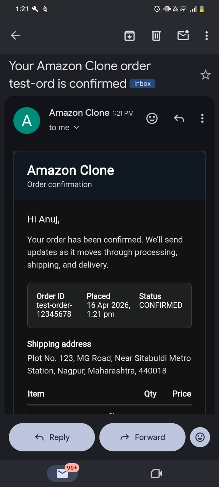
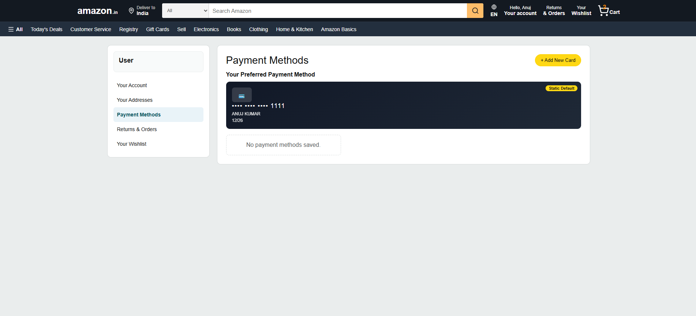
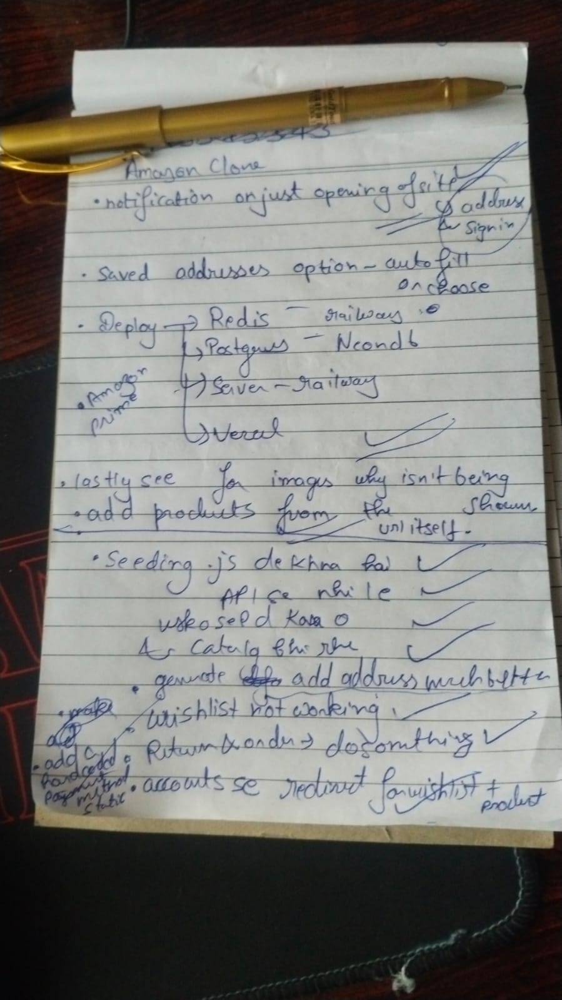

# Server Application

Express API for the Amazon Clone project using Prisma and PostgreSQL.

## Live URL

- Backend API: https://amazon-clone-scalar-assignment.onrender.com

## Responsibilities

- Product, category, cart, order, wishlist, review, and account APIs
- Seed pipeline for realistic catalog and order data
- Idempotent order placement with stock-safe transactions
- Order confirmation email dispatch via SMTP

## Commands

```bash
npm run dev
npm start
npm run db:push
npm run db:seed
npm run db:generate
npm run db:studio
```

## Environment

Copy server/.env.example to server/.env and set values.

Required:

- DATABASE_URL
- DIRECT_URL
- PORT
- CORS_ORIGIN

Optional email:

- SMTP_HOST
- SMTP_PORT
- SMTP_SECURE
- SMTP_USER
- SMTP_PASS
- MAIL_FROM

## Health Endpoint

- GET /api/health

## Deployment

- Platform: Render Web Service
- Root Directory: server
- Build Command: npm install --include=dev && npx prisma@5.22.0 generate
- Start Command: npm start
- CORS_ORIGIN should include local and deployed frontend origins

## Server-Related Screenshots

### Order Confirmation Email



### Account Data Example



### Brainstorming and Architecture Notes


